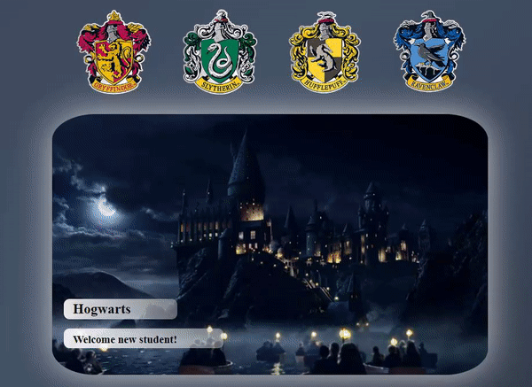

# Sorting Hat Website 
We are excited to welcome you as a full time student at Hogwarts School of Witchcraft and Wizardry!

## Magical Features
Click on the various house crests to learn what animal represents said house. When you are ready,\
answer the sorting hats questions as best you can to determine what house you shall be placed in.\
The sorting hat will consider all of your answers and place you in the house that best fits you!

Once you have been placed in a house, you will be given a password to your dormitory. Inside, you
will gain access to various information about that house.

 
## Visuals

## Usage
The sorting hat takes three answers and calculates the best house for you based on your selections. Each\
answer is weighted towards a specific house and the house with the most points is chosen to be yours. Once\
chosen, the page returns the password for that specific house allowing you to access various details for\
whichever house was chosen.

## Support
If you feel you were placed into the wrong house by the sorting hat, Hogwarts School of Witchcraft and Wizardry\
offers full time counseling as the sorting hat never makes a mistake!

## Authors
### -Chen Jiang
### -Melissa Elizondo
### -Michael Urezzio